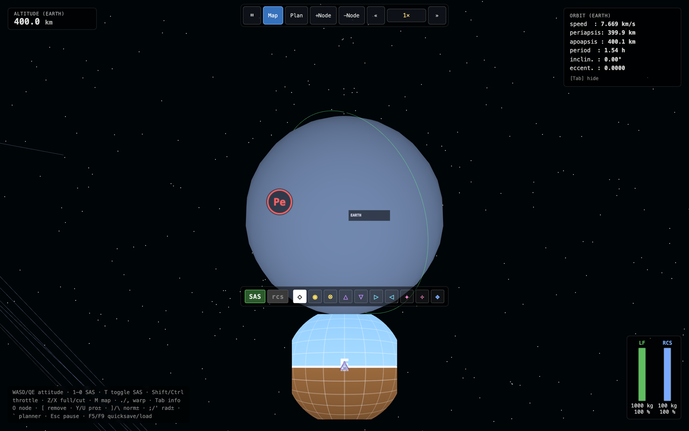
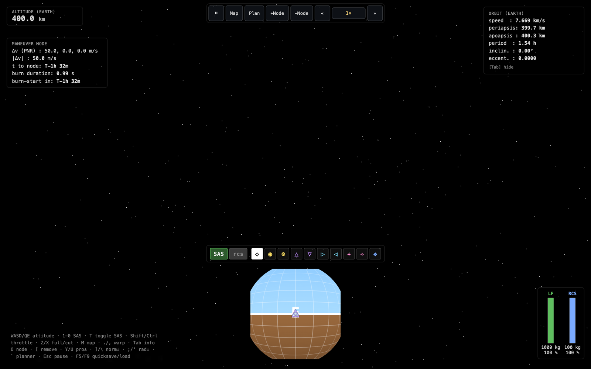
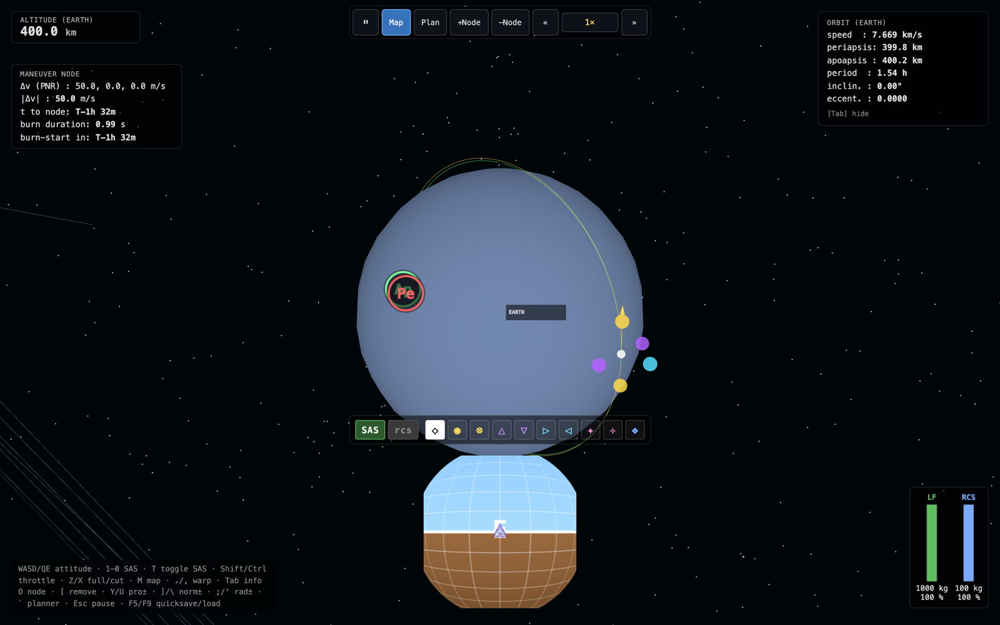
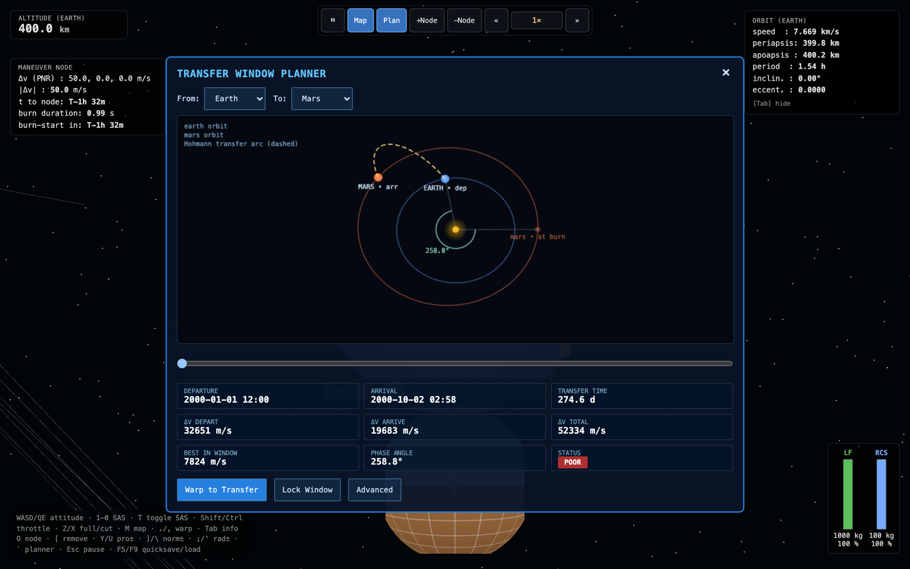

# N-Body Spaceflight Sim - orbital mechanics in the browser

> A spaceflight sandbox inspired by Kerbal Space Program. It simulates 31 solar-system bodies using JPL Horizons data and n-body gravity in a Web Worker. You can fly a craft, plan maneuvers and transfers, and use time warp for trips between planets and moons.

**Live demo:** Not yet public. A browser build is planned for [bretmerritt.com](https://www.bretmerritt.com).

This repository describes the simulator. The source code is private.

  

---

## Overview

The simulator focuses on flying a pre-built craft. It has no ship builder, career mode, or science progression. At each step, it calculates the gravitational pull between every pair of massive bodies, as in Principia, instead of using patched-conic approximations. Physics runs at a fixed rate in a worker, separate from rendering and input, with time warp up to 100,000×.

## Screenshots

| Flight HUD & navball | Maneuver node |
|---|---|
|  |  |

| Transfer window planner (Earth → Mars) |
|---|
|  |

## Features

- **Solar system:** 31 bodies (the Sun, planets, and major moons) with real masses, radii, and rotation, initialized from JPL Horizons J2000 state vectors.
- **N-body physics:** A Blanes and Moan symplectic Runge-Kutta-Nyström integrator uses Float64 typed arrays in a Web Worker with Comlink RPC. An RK4 fallback is available for verification, and an adaptive integrator predicts trajectories.
- **Flight controls:** Attitude, throttle, RCS translation, and SAS modes for stability, prograde/retrograde, normal/anti-normal, radial in/out, target/anti-target, and maneuver hold. Controls use KSP-style keyboard and gamepad bindings.
- **Navball and map view:** Three.js rendering with a floating origin and logarithmic depth buffer to handle a 10¹³ m range. The map shows orbit lines, periapsis and apoapsis markers, and predicted trajectories.
- **Maneuver nodes:** Create, drag, and execute nodes using prograde, normal, and radial controls. Burn-duration estimates use the craft's thrust.
- **Transfer planner:** Simple and advanced modes with a porkchop-style departure scrubber, Hohmann and Izzo-Lambert solutions, LEO ejection Δv, and "warp to transfer".
- **Spheres of influence:** The craft's dominant body changes as it crosses an SOI boundary. The HUD, map, and planner update to match.
- **Time warp and saves:** Time warp from 1× to 100,000×, quicksave/quickload, and named saves in IndexedDB. Saves use pako compression and a versioned schema with migrations. The app also has a pause menu, touch controls, and a performance HUD.

## Technologies

TypeScript (strict) · Vite · Three.js · Web Workers + Comlink · gl-matrix · Zustand · IndexedDB + pako · Vitest

## Engineering notes

- **Physics worker:** High time warp requires tens of thousands of integration steps per second. Running those steps in a worker keeps that calculation off the thread handling input and rendering.
- **Prediction worker:** Trajectory prediction runs in a separate worker. Its polyline reuses a GPU buffer instead of allocating about 50 kB of geometry on each refresh.
- **Coordinate precision:** A floating origin keeps the craft near (0,0,0) for rendering, while the simulation uses solar-system barycentric coordinates.
- **Tests:** About 390 unit tests cover the integrators, Kepler and Lambert solvers, SOI changes, save migrations, and input routing. One test exposed a physics bug that produced NaN positions without a visible error.
- I worked from a written specification with acceptance criteria for each phase and a backlog for later features. Each phase passed type checks and tests before I moved on.

## Status

Built April 2026 (118 commits, about 23k lines of TypeScript). Earlier versions used a smaller, compressed solar system before I switched to real SI units. A related project, Orbital, uses patched conics and a Lambert autopilot for Earth-to-Mars flights. I also explored the design in a Unity/C# prototype called Artemis Sim.

## Development

I built the simulator using Claude Code for coding assistance, following the specification and acceptance criteria I wrote.

---

*Bret Merritt · [GitHub](https://github.com/bretm9) · [LinkedIn](https://www.linkedin.com/in/bret-merritt) · merrittbret9@gmail.com*
